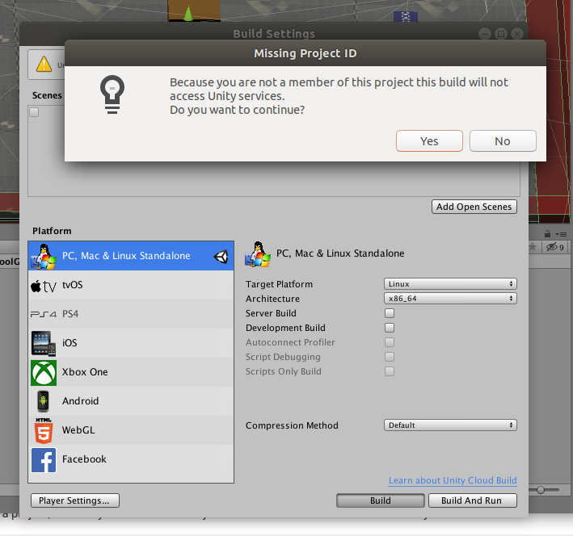

# Arena-BuildingToolkit


Single/Multi-agent intelligence is still at the stage where many problems remain unexplored. As a part of [Arena](https://sites.google.com/view/arena-unity/) project, this repository is to provide a building toolkit for researchers to easily invent and build novel single/multi-agent problems.
More resources can be found in [Arena Home](https://sites.google.com/view/arena-unity/).
If you use this repository to conduct research, we kindly ask that you [cite the paper](#citation) as a reference.

## Status: Release

We are currently open to any suggestions or pull requests from the community to make Arena a better platform.
To contribute to the project, [joint us in  Slack](https://join.slack.com/t/arena-ml/shared_invite/enQtNjc1NDE1MTY0MjU3LWMxMjZiMTYyNTE3OWIzM2QxZjU5YmI1NTM2YzYzZDZlNjY0NzllMDFlMjA3MGZiN2QxODA1NTJhZDkzOTI3Nzg), check [To Do list in Trello](https://trello.com/b/dmGHVIM0) as well as check [issues](https://github.com/YuhangSong/Arena-BuildingToolkit/issues) opened in the repo.
If you have a game in mind you want to study, you are wellcome to [contact us via Slack](https://join.slack.com/t/arena-ml/shared_invite/enQtNjc1NDE1MTY0MjU3LWMxMjZiMTYyNTE3OWIzM2QxZjU5YmI1NTM2YzYzZDZlNjY0NzllMDFlMjA3MGZiN2QxODA1NTJhZDkzOTI3Nzg) or open an issue.
We are happy to implement it for you, if it's helpful for the community.

## Table of Contents

**Note:** bare with me on my typos and open up a pull request to fix them, I appreciate it.

<!-- TOC depthFrom:1 depthTo:6 withLinks:1 updateOnSave:1 orderedList:0 -->

- [Arena-BuildingToolkit](#arena-buildingtoolkit)
	- [Status: Release](#status-release)
	- [Table of Contents](#table-of-contents)
	- [Get Started](#get-started)
		- [Folder Structure](#folder-structure)
		- [Scene Structure](#scene-structure)
			- [Essential Scene Structure](#essential-scene-structure)
			- [Suggested Scene Structure](#suggested-scene-structure)
		- [Set NodeID](#set-nodeid)
		- [Switching Between Cameras](#switching-between-cameras)
		- [Compile Game to Binary File](#compile-game-to-binary-file)
	- [Utilities](#utilities)
		- [Visualize Vector Observation](#visualize-vector-observation)
		- [Visualize Visual Observation](#visualize-visual-observation)
		- [Lidar Sensor](#lidar-sensor)
		- [Use Transform Reinitializers](#use-transform-reinitializers)
		- [Dynamically Change Social Tree Structure](#dynamically-change-social-tree-structure)
		- [Log Information](#log-information)
		- [UI Percentage Bar](#ui-percentage-bar)
	- [Reward Function](#reward-function)
		- [Reward Function Based on Distance](#reward-function-based-on-distance)
		- [Use Dense Reward Functions](#use-dense-reward-functions)
		- [Use More Agent Prefabs](#use-more-agent-prefabs)
	- [Agent Prefabs](#agent-prefabs)
		- [Use Gun to Attack](#use-gun-to-attack)
		- [Show Aim Line](#show-aim-line)
		- [Gun Attack with Raycast](#gun-attack-with-raycast)
		- [Snake Agent](#snake-agent)
	- [Playground Prefabs](#playground-prefabs)
		- [Use Eatable Prefabs](#use-eatable-prefabs)
		- [Playground with Maze](#playground-with-maze)
		- [Playground with Barriers](#playground-with-barriers)
	- [Randomization](#randomization)
		- [Light Randomization](#light-randomization)
		- [Physical Properties Randomization](#physical-properties-randomization)
	- [Advanced](#advanced)
		- [Upgrade/Change Version of ML-Agents](#upgradechange-version-of-ml-agents)
		- [Make Your Game More Neat with Prefabs](#make-your-game-more-neat-with-prefabs)
		- [Handling Variants of Your Games Efficiently](#handling-variants-of-your-games-efficiently)
	- [Citation](#citation)
	- [License](#license)
	- [Acknowledgement](#acknowledgement)
	- [References](#references)

<!-- /TOC -->

## Get Started

This section will take you through the entire pipline of making an Arena game.

Clone the project to your computer,
download and install Unity Editor **2018.4.13f1** Personal, download [here](https://unity3d.com/get-unity/download/archive).
Open the project with Unity Editor.

### Folder Structure

- Assets
  - ML-Agents: supports from Unity ML-Agents
  - ArenaSDK
    - Brains: where we put shared brains for agents
    - Code Format: where we put a formating config file that can be used if you are using Atom with package [atom-beautify](https://github.com/Glavin001/atom-beautify). It can be used to format code as we did in the project
    - GameSet: where we put all the games
    - Images: images we are using in the project
    - Materials: materials we are using in the project
    - PhysicMaterial: physic material we are using in the project
    - ThirdPartyAssets: third-party assets used in the project
    - Prefabs: all the prefabs including that of the agents, playgrouds and etc.
    - Scripts: all the scripts

### Scene Structure

**Note** that we will not be demonstrating how to make an Arena game scene from scretch, we will explain how an Arena game is structured. After this, by looking at and playing with all the example games, you will find it easy to create your own variants or a new one from scretch.

Before you start, we are expecting you to have basic knowledge on Unity. Thus, you are recommended to finish the [Roll-a-ball tutorial](https://learn.unity.com/project/roll-a-ball-tutorial) to learn some basic concepts of Unity.

A typical game scene in Arena looks like the following picture, where agents are orginized in a tree hierarchy. At each node, you can change the relationship of the agents under this node by selecting different reward functions. The example below shows that

- under the global node, the two team nodes are competitive, such as which box reaches the target first;
- under the team node, the two agent nodes are collaborative, such as the distance that the box being moved forward;
- at the agent node, the agent receive independent rewards, such as that encouraging moving forward.


The above example game can be found in ```./Assets/ArenaSDK/GameSet/ArenaCrawlerPush/Dense-2T2P```.

The tree structure can be easily altered by dragging, duplicating, or deleting nodes in the GUI interface.
The relationship defined by each node can be easily altered by selecting another reward function from the dropdown list at each node. An demonstration of quick creation of social structures can be found in this [[Video]](https://youtu.be/80siqkLI_vY).

#### Essential Scene Structure

The above is achieved by attaching scripts to the scene in the following manner:

- ```GlobalManager.cs``` ```ArenaNode.cs```
  - ```ArenaNode.cs```
    - ```ArenaNode.cs``` ```ArenaAgent.cs```
    - ```ArenaNode.cs``` ```ArenaAgent.cs```
  - ```ArenaNode.cs```
    - ```ArenaNode.cs``` ```ArenaAgent.cs```
    - ```ArenaNode.cs``` ```ArenaAgent.cs```

Note that there can be hierarchies of more than 3 levels, asymmetry and dynamic hierarchies.

#### Suggested Scene Structure

The above scene structure is essential to make an Arena environments.
However, additional components are suggested:

- ```GlobalManager.cs``` ```ArenaNode.cs```
  - ```TopDownCamera```: this is a prefab, looking down at the playgroud top-down. In this camera, the ID of each agent is visable so that you can see how agents of different IDs interact with each other.
  - ```VisualizationCamera```: this is a prefab, looking at the playgroud from nice angle, where you have the best view of the game field.
  - ```World```: this is where you put game objects that belongs to the global world. For example, in the Tennis game, put the ball here.
  - ```ArenaNode.cs```
  	- ```World```: this is where you put game objects that belongs to each team. For example, in the game of collaboratively pushing a box, put the box here.
    - ```ArenaNode.cs``` ```ArenaAgent.cs```
    - ```ArenaNode.cs``` ```ArenaAgent.cs```
  - ```ArenaNode.cs```
    - ```World```
    - ```ArenaNode.cs``` ```ArenaAgent.cs```
    - ```ArenaNode.cs``` ```ArenaAgent.cs```

To gain more understanding of games under Arena framework and work with them, take a look at more games in the ```./Assets/ArenaSDK/GameSet/```. Also, contact us if you find any difficulties, we will add documentations accordingly. (For now, the feedback is that it is quite easy to understand and get one's hands on.)

### Set NodeID

[[Video]](https://youtu.be/aT7gEMf4Hqw)

Set valid NodeID.

### Switching Between Cameras

One camera takes the whole window at one time, press F1 and F2 to navigate across different cameras.

### Compile Game to Binary File

[[Video]](https://youtu.be/ASiV61OPRFI)

Compile your game to a binary file, and train with [Arena-Baselines](https://github.com/YuhangSong/Arena-Baselines).
You may encounter a warning message as follows:



just ignore it. It is promoted because with a plus/pro versions of Unity or if you are an member of this project registered on Unity you get access to things like cloud build and other services, but this isn't needed at all.

If you intend to run your built game on [Arena-Baselines](https://github.com/YuhangSong/Arena-Baselines), naming the compiled game file should follow specific rules as described in [Common Naming Rules](https://github.com/YuhangSong/Arena-Benchmark/blob/master/README.md#common-naming-rules). And register the ID of the game in [Arena-Baselines](https://github.com/YuhangSong/Arena-Baselines) according to [Register New Games](https://github.com/YuhangSong/Arena-Baselines#register-new-games).

## Utilities

In the above section, you went through the entire pipline of making an Arena game, hope you enjoy it.
Go on with this section to explore more handy utilities in Arena.

### Visualize Vector Observation

[[Video]](https://youtu.be/7kaLTscbmV0)

After you add some vector observations to your agent, you may want to check if they make sense for the agent.

- All ArenaAgent are equipped with this visualization tool by default.
- It provides flexible ways to investigate/preview the vector observation.
- It is only enabled in Unity editor, and will not slow down your game when it is compiled for the target platform.

### Visualize Visual Observation

[[Video]](https://youtu.be/1dMcLsd72vY)

After you add some visual observations via AgentCamera prefab to your agent, you may want to check if the actual observation for agent (smaller and maybe in grayscale) makes sense.

- All ArenaAgent are equipped with this visualization tool by default.
- It provides flexible ways to investigate/preview the visual observation.
- It is also supported in a compiled game, though not recommended, as it slows down your game.
- The baseline side of Arena project provides better visualization tool for the compiled game.

### Lidar Sensor

[[Video]](https://youtu.be/UKIrHM6C43Y)

[Lidar sensor](https://www.slamtec.com/en/Lidar/A3) is widely used in robots to get precise low dimensional representation of the surroundings.
Lidar sensor is suitable for robotic SLAM applications. It provides 360 degree scan field, certain rotating frequency with certain ranger distance. Lidar is the ideal sensor in cost sensitive areas like robots consumer and hardware hobbyist.
It is also recently used as a representation for game AI, see [OpenAI Hide-and-seek](https://openai.com/blog/emergent-tool-use/).
We also included a series of features for visualizing and testing lidar sensor.
We would recommend using the game ```./Assets/ArenaSDK/GameSet/Tennis``` as an example to play with lidar sensor.

- **Note:** When set ScanFramePerSecond to a positive number, you will still get all the data from lidar at each step, the difference is that some of the data is not refreshed, i.e., only part of data is refreshed at each step. This corresponding to the limited scan frequency of a real lidar sensor.

### Use Transform Reinitializers

[[Video]](https://youtu.be/_A1J4l5xVck)

Use transform reinitializers to re-initialize objects at the reset of each episode.

### Dynamically Change Social Tree Structure

Arena-BuildingToolkit now supports dynamically change social tree structure, during an episode, or at the reset of an episode.

This could open up an interesting research direction of multi-agent learning with agents dies or newly born dynamically. We temporally refer to this kind of problem as "social lifelong learning", in contrast to "lifelong learning" in the context of single agent learning. Say: Can the agent learns to give birth to a specific number of babies, based on the resources it has and the stage of the society / population.

Other interesting directions under this setting could be ad-hoc teamwork where you need to train an agent (or a group of them) to complement an existing set of teammates.

### Log Information

[[Video]](https://youtu.be/6qb2AMkbaHI)

### UI Percentage Bar

[[Video]](https://youtu.be/5lFUfiUz054)

Identify where the log information comes from.

## Reward Function

### Reward Function Based on Distance

[[Video]](https://youtu.be/EifSl1edwE8)

Use reward function based on distance.

### Use Dense Reward Functions

[[Video]](https://youtu.be/LK7G1apTgZI)

Use multiple off-the-shelf dense reward functions.

### Use More Agent Prefabs

[[Video]](https://youtu.be/ExDZA3720fU)

Use multiple off-the-shelf agent prefabs in Arena-BuildingToolkit.

## Agent Prefabs

### Use Gun to Attack

[[Video]](https://youtu.be/uhBbX6qCgg4)

Use gun to fire a bullet, which will kill an agent.

### Show Aim Line

[[Video]](https://youtu.be/sGm78LKt-4k)

Show an aim line for visualizing your gun attack.

### Gun Attack with Raycast

[[Video]](https://youtu.be/Io2-p9j9BOg)

Use Raycast for gun attack, which is safer and more efficient than firing a bullet.

### Snake Agent

[[Video]](https://youtu.be/qv5d64y1sLo)

Snake is the common name for a video game concept where the player maneuvers a line which grows in length, with the line itself being a primary obstacle. The concept originated in the 1976 arcade game Blockade, and the ease of implementing Snake has led to hundreds of versions (some of which have the word snake or worm in the title) for many platforms. See [Wiki Page](https://en.wikipedia.org/wiki/Snake_(video_game_genre)).

## Playground Prefabs

### Use Eatable Prefabs

[[Video]](https://youtu.be/__kiwrXUTLU)

Add eatable objects to the game.

### Playground with Maze

[[Video]](https://youtu.be/v72ejCHiePQ)

A playground with randomly regenerated maze at the every episode.

### Playground with Barriers

[[Video]](https://youtu.be/GMTCrP-C5_c)

A playground with randomly regenerated barriers at the every episode.

## Randomization

### Light Randomization

[[Video]](https://youtu.be/bO-xZM0sWj0)

Randomize all lights in the game.

### Physical Properties Randomization

[[Video]](https://youtu.be/xUO2KJXjMS0)

Randomize physical properties in the game.

## Advanced

### Upgrade/Change Version of ML-Agents

How to upgrade or change the version of the Unity ML-Agent dependence.
Override "Assets/ML-Agents" with the the recent ML-Agent folder here.
Apply several changes in ML-Agent:

- change "public BroadcastHub broadcastHub = new BroadcastHub();" in "Assets/ML-Agents/Scripts/Academy.cs" to "[HideInInspector] public BroadcastHub broadcastHub = new BroadcastHub();"
- change "AgentInfo info;" in "Assets/ML-Agents/Scripts/Agent.cs" to "protected AgentInfo info;"
- change "AgentInfo m_Info;" in "Assets/ML-Agents/Scripts/Agent.cs" to "protected AgentInfo info;"

### Make Your Game More Neat with Prefabs

[[Video]](https://youtu.be/Jj9Qjlo-vss)

Suggestions on how to prefab you game so that you can enjoy cleaner project.

###  Handling Variants of Your Games Efficiently

[[Video]](https://youtu.be/N21ghyksJd4)

How to handle different configurations of your games with prefabs and prefab variants.
- Prefab - GlobalManager in "Assets/ArenaSDK/Prefabs/" handles settings of all games.
- Prefab Variant - GlobalManager Variant in "Assets/ArenaSDK/GameSet/[cool_game]/" handles settings of the specific game [cool_game].

## Citation

If you use Arena to conduct research, we ask that you cite the following paper as a reference:
```
@article{song2019arena,
  title={Arena: A General Evaluation Platform and Building Toolkit for Multi-Agent Intelligence},
  author={Song, Yuhang and Wang, Jianyi and Lukasiewicz, Thomas and Xu, Zhenghua and Xu, Mai and Ding, Zihan and Wu, Lianlong},
  journal={arXiv preprint arXiv:1905.08085},
  year={2019}
}
```
as well as the engine behind Arena, without which the platform would be impossible to create
```
@article{juliani2018unity,
  title={Unity: A general platform for intelligent agents},
  author={Juliani, Arthur and Berges, Vincent-Pierre and Vckay, Esh and Gao, Yuan and Henry, Hunter and Mattar, Marwan and Lange, Danny},
  journal={arXiv preprint arXiv:1809.02627},
  year={2018}
}
```

## License

[Apache License 2.0](LICENSE)

## Acknowledgement

We give special thanks to the [Whiteson Research Lab](http://whirl.cs.ox.ac.uk/) and [ML-Agents team](https://unity3d.com/machine-learning/), with which the discussion shaped the vision of the project a lot.
Also, we use some free packages from [Unity Assets Store](https://assetstore.unity.com/) list in [the reference section](#references), the code of which is publically available in the Unity Assets Store.
We thank them for their generosity and contribution to the community.

We also use two packages that is not free (list in [the reference section](#references)), thus, the code of these two packages is not included in the code release.
But the compiled binary files are released in [Arena-Baselines](https://github.com/YuhangSong/Arena-Baselines).

## References
* [Tower Defense Template](https://assetstore.unity.com/packages/essentials/tutorial-projects/107692)
* [Low Poly Crates](https://assetstore.unity.com/packages/3d/props/80037)
* [Low Polygon Soccer Ball](https://assetstore.unity.com/packages/3d/84382)
* [Space Robot Kyle](https://assetstore.unity.com/packages/3d/characters/robots/4696)
* [Ragdoll and Transition to Mecanim](https://assetstore.unity.com/packages/templates/systems/ragdoll-and-transition-to-mecanim-38568)
* [Free Little Games Asset Pack](https://assetstore.unity.com/packages/3d/props/free-little-games-asset-pack-125089)
* [Video Capture](https://assetstore.unity.com/packages/tools/video/video-capture-75653)
* [SimplePoly Stadium Kit](https://assetstore.unity.com/packages/3d/environments/simplepoly-stadium-kit-59071)
* [Do not shoot Aliens - mobile game](https://assetstore.unity.com/packages/templates/packs/do-not-shoot-aliens-mobile-game-137557)
* [Space Shooter FREE](https://assetstore.unity.com/packages/templates/packs/space-shooter-free-107260)
* [Third Person Controller - Basic Locomotion FREE](https://assetstore.unity.com/packages/templates/systems/third-person-controller-basic-locomotion-free-82048)
* [Photon Unity Networking Classic - FREE](https://assetstore.unity.com/packages/tools/network/photon-unity-networking-classic-free-1786)
* [Sun Temple](https://assetstore.unity.com/packages/3d/environments/sun-temple-115417)
* [House On The Lake](https://assetstore.unity.com/packages/3d/environments/house-on-the-lake-95020)
* [Sci-Fi Styled Modular Pack](https://assetstore.unity.com/packages/3d/environments/sci-fi/sci-fi-styled-modular-pack-82913)
* [Nature Starter Kit 2](https://assetstore.unity.com/packages/3d/environments/nature-starter-kit-2-52977)
* [Mountain Race Track - Night](https://assetstore.unity.com/packages/3d/environments/roadways/mountain-race-track-night-68199)
* [Race Tracks](https://assetstore.unity.com/packages/3d/environments/roadways/race-tracks-140501)
* [Windridge City](https://assetstore.unity.com/packages/3d/environments/roadways/windridge-city-132222)
* [Flooded Grounds](https://assetstore.unity.com/packages/3d/environments/flooded-grounds-48529)
* [Rule Engine](https://assetstore.unity.com/packages/tools/rule-engine-60198)
* [Forge Networking Remastered](https://assetstore.unity.com/packages/tools/network/forge-networking-remastered-38344)
* [SmartFoxServer2X Multiplayer SDK](https://assetstore.unity.com/packages/tools/network/smartfoxserver2x-multiplayer-sdk-17261)
* [FPSME](https://assetstore.unity.com/packages/templates/systems/fpsme-114434)
* [Full Body FPS Controller](https://assetstore.unity.com/packages/templates/systems/full-body-fps-controller-134060)
* [Polygon City Pack - Environment and Interior [Free]](https://assetstore.unity.com/packages/3d/polygon-city-pack-environment-and-interior-free-101685)
* [Easy FPS](https://assetstore.unity.com/packages/3d/characters/humanoids/easy-fps-73776)
* [Sport Car - 3D model](https://assetstore.unity.com/packages/3d/characters/sport-car-3d-model-88076)
* [SBP Vehicle Physics](https://assetstore.unity.com/packages/3d/characters/sbp-vehicle-physics-60459)
* [The Virus war](https://assetstore.unity.com/packages/templates/the-virus-war-7891)
* [Simple Pinball](https://assetstore.unity.com/packages/templates/packs/simple-pinball-80053)
* [Lake Race Track](https://assetstore.unity.com/packages/3d/environments/roadways/lake-race-track-55908)
* [Free Barcade Asset Pack](https://assetstore.unity.com/packages/3d/props/free-barcade-asset-pack-123704)
* [Snake 3D cartoon with Pads Android Ready](https://assetstore.unity.com/packages/tools/integration/snake-3d-cartoon-with-pads-android-ready-74895)
* [Chainlink Fences](https://assetstore.unity.com/packages/3d/chainlink-fences-73107)
* [Post Processing Stack](https://assetstore.unity.com/packages/essentials/post-processing-stack-83912)
* [Low Poly Boxing LITE](https://assetstore.unity.com/packages/3d/characters/humanoids/low-poly-boxing-lite-133958)
* [Fighting Motions Vol.1](https://assetstore.unity.com/packages/3d/animations/fighting-motions-vol-1-76699)
* [Fighter Interceptor](https://assetstore.unity.com/packages/3d/vehicles/air/fighter-interceptor-102321)
* [Mixed Motion](https://assetstore.unity.com/packages/3d/animations/mixed-motion-25837)
* [T95 Super Heavy Tank](https://assetstore.unity.com/packages/3d/vehicles/land/t95-super-heavy-tank-101164)
* [Fantasy Defensive Structures](https://assetstore.unity.com/packages/3d/environments/fantasy/fantasy-defensive-structures-3307)
* [Tileable Bricks Wall](https://assetstore.unity.com/packages/2d/textures-materials/brick/tileable-bricks-wall-24530)
* [Terrain Textures - Snow - Free Samples](https://assetstore.unity.com/packages/2d/textures-materials/floors/terrain-textures-snow-free-samples-54630)
* [15 Original Bricks Textures](https://assetstore.unity.com/packages/2d/textures-materials/brick/15-original-bricks-textures-72427)
* [Tank - Mark V drivable](https://assetstore.unity.com/packages/3d/vehicles/land/tank-mark-v-drivable-76008)
* [Simple Health Bar FREE](https://assetstore.unity.com/packages/tools/gui/simple-health-bar-free-95420)
* [SciFi Enemies and Vehicles](https://assetstore.unity.com/packages/3d/characters/robots/scifi-enemies-and-vehicles-15159)
* [Free Trees](https://assetstore.unity.com/packages/3d/vegetation/trees/free-trees-103208)
* [Tree Randomizer](https://assetstore.unity.com/packages/tools/utilities/tree-randomizer-59228)
* [Rock Pack](https://assetstore.unity.com/packages/3d/environments/landscapes/rock-pack-19856)
* [Substance in Unity](https://assetstore.unity.com/packages/tools/utilities/substance-in-unity-110555)
* [Hand Painted Grass Texture](https://assetstore.unity.com/packages/2d/textures-materials/floors/hand-painted-grass-texture-78552)
* [Stone Floor Texture](https://assetstore.unity.com/packages/2d/textures-materials/stone/stone-floor-texture-20336)
* [Unity Particle Pack 5.x](https://assetstore.unity.com/packages/essentials/asset-packs/unity-particle-pack-5-x-73777)
* [Maze Generator](https://assetstore.unity.com/packages/tools/modeling/maze-generator-38689)
