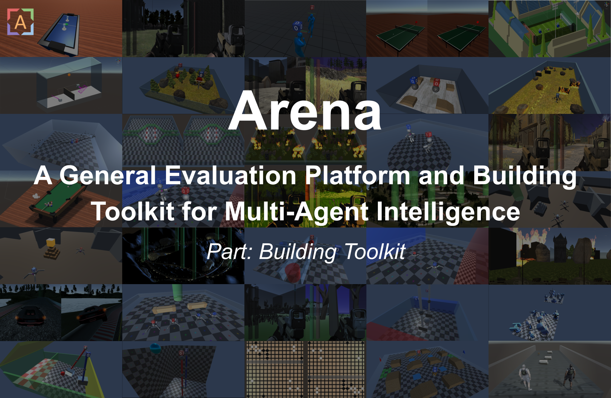
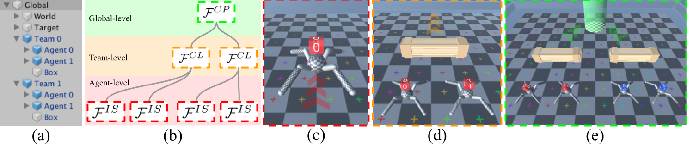

# Introduction


Multi-agent intelligence is still at the stage where many problems remain unexplored. As a part of [Arena](https://sites.google.com/view/arena-unity/) project, this repository is to provide a building toolkit for researchers to easily invent and build novel multi-agent problems.
More resources can be found in [Arena Home](https://sites.google.com/view/arena-unity/).
If you use this repository to conduct research, we kindly ask that you [cite the paper](#citation) as a reference.

## Status: Pre-release

We are currently open to any suggestions or pull requests from the community to make Arena a better platform.
To contribute to the project, [contact us via Slack](https://join.slack.com/t/arena-ml/shared_invite/enQtNjc1NDE1MTY0MjU3LWMxMjZiMTYyNTE3OWIzM2QxZjU5YmI1NTM2YzYzZDZlNjY0NzllMDFlMjA3MGZiN2QxODA1NTJhZDkzOTI3Nzg).
If you have a game in mind you want to study, you are wellcome to [contact us via Slack](https://join.slack.com/t/arena-ml/shared_invite/enQtNjc1NDE1MTY0MjU3LWMxMjZiMTYyNTE3OWIzM2QxZjU5YmI1NTM2YzYzZDZlNjY0NzllMDFlMjA3MGZiN2QxODA1NTJhZDkzOTI3Nzg) or open an issue.
We are happy to implement it for you, if it's helpful for the community.

## Get Started

Follow our short and simple tutorials in [Tutorials: Building Toolkit](https://sites.google.com/view/arena-unity/home/tutorials-building-toolkit), which should get you ready in minutes.



## Citation

If you use Arena to conduct research, we ask that you cite the following paper as a reference:
```
@article{song2019arena,
  title={Arena: A General Evaluation Platform and Building Toolkit for Multi-Agent Intelligence},
  author={Song, Yuhang and Wang, Jianyi and Lukasiewicz, Thomas and Xu, Zhenghua and Xu, Mai and Ding, Zihan and Wu, Lianlong},
  journal={arXiv preprint arXiv:1905.08085},
  year={2019}
}
```
as well as the engine behind Arena, without which the platform would be impossible to create
```
@article{juliani2018unity,
  title={Unity: A general platform for intelligent agents},
  author={Juliani, Arthur and Berges, Vincent-Pierre and Vckay, Esh and Gao, Yuan and Henry, Hunter and Mattar, Marwan and Lange, Danny},
  journal={arXiv preprint arXiv:1809.02627},
  year={2018}
}
```

## License

[Apache License 2.0](LICENSE)

## Acknowledgement

We give special thanks to the [Whiteson Research Lab](http://whirl.cs.ox.ac.uk/) and [ML-Agents team](https://unity3d.com/machine-learning/), with which the discussion shaped the vision of the project a lot.
Also, we use some free packages from [Unity Assets Store](https://assetstore.unity.com/) list in [the reference section](#references), the code of which is publically available in the Unity Assets Store.
We thank them for their generosity and contribution to the community.

We also use two packages that is not free (list in [the reference section](#references)), thus, the code of these two packages is not included in the code release.
But the compiled binary files are released in [Arena-Baselines](https://github.com/YuhangSong/Arena-Baselines).

## References
* [Tower Defense Template](https://assetstore.unity.com/packages/essentials/tutorial-projects/107692)
* [Low Poly Crates](https://assetstore.unity.com/packages/3d/props/80037)
* [Low Polygon Soccer Ball](https://assetstore.unity.com/packages/3d/84382)
* [Space Robot Kyle](https://assetstore.unity.com/packages/3d/characters/robots/4696)
* [Ragdoll and Transition to Mecanim](https://assetstore.unity.com/packages/templates/systems/ragdoll-and-transition-to-mecanim-38568)
* [Free Little Games Asset Pack](https://assetstore.unity.com/packages/3d/props/free-little-games-asset-pack-125089)
* [Video Capture](https://assetstore.unity.com/packages/tools/video/video-capture-75653)
* [SimplePoly Stadium Kit](https://assetstore.unity.com/packages/3d/environments/simplepoly-stadium-kit-59071)
* [Do not shoot Aliens - mobile game](https://assetstore.unity.com/packages/templates/packs/do-not-shoot-aliens-mobile-game-137557)
* [Space Shooter FREE](https://assetstore.unity.com/packages/templates/packs/space-shooter-free-107260)
* [Third Person Controller - Basic Locomotion FREE](https://assetstore.unity.com/packages/templates/systems/third-person-controller-basic-locomotion-free-82048)
* [Photon Unity Networking Classic - FREE](https://assetstore.unity.com/packages/tools/network/photon-unity-networking-classic-free-1786)
* [Sun Temple](https://assetstore.unity.com/packages/3d/environments/sun-temple-115417)
* [House On The Lake](https://assetstore.unity.com/packages/3d/environments/house-on-the-lake-95020)
* [Sci-Fi Styled Modular Pack](https://assetstore.unity.com/packages/3d/environments/sci-fi/sci-fi-styled-modular-pack-82913)
* [Nature Starter Kit 2](https://assetstore.unity.com/packages/3d/environments/nature-starter-kit-2-52977)
* [Mountain Race Track - Night](https://assetstore.unity.com/packages/3d/environments/roadways/mountain-race-track-night-68199)
* [Race Tracks](https://assetstore.unity.com/packages/3d/environments/roadways/race-tracks-140501)
* [Windridge City](https://assetstore.unity.com/packages/3d/environments/roadways/windridge-city-132222)
* [Flooded Grounds](https://assetstore.unity.com/packages/3d/environments/flooded-grounds-48529)
* [Rule Engine](https://assetstore.unity.com/packages/tools/rule-engine-60198)
* [Forge Networking Remastered](https://assetstore.unity.com/packages/tools/network/forge-networking-remastered-38344)
* [SmartFoxServer2X Multiplayer SDK](https://assetstore.unity.com/packages/tools/network/smartfoxserver2x-multiplayer-sdk-17261)
* [FPSME](https://assetstore.unity.com/packages/templates/systems/fpsme-114434)
* [Full Body FPS Controller](https://assetstore.unity.com/packages/templates/systems/full-body-fps-controller-134060)
* [Polygon City Pack - Environment and Interior [Free]](https://assetstore.unity.com/packages/3d/polygon-city-pack-environment-and-interior-free-101685)
* [Easy FPS](https://assetstore.unity.com/packages/3d/characters/humanoids/easy-fps-73776)
* [Sport Car - 3D model](https://assetstore.unity.com/packages/3d/characters/sport-car-3d-model-88076)
* [SBP Vehicle Physics](https://assetstore.unity.com/packages/3d/characters/sbp-vehicle-physics-60459)
* [The Virus war](https://assetstore.unity.com/packages/templates/the-virus-war-7891)
* [Simple Pinball](https://assetstore.unity.com/packages/templates/packs/simple-pinball-80053)
* [Lake Race Track](https://assetstore.unity.com/packages/3d/environments/roadways/lake-race-track-55908)
* [Free Barcade Asset Pack](https://assetstore.unity.com/packages/3d/props/free-barcade-asset-pack-123704)
* [Snake 3D cartoon with Pads Android Ready](https://assetstore.unity.com/packages/tools/integration/snake-3d-cartoon-with-pads-android-ready-74895)
* [Chainlink Fences](https://assetstore.unity.com/packages/3d/chainlink-fences-73107)
* [Post Processing Stack](https://assetstore.unity.com/packages/essentials/post-processing-stack-83912)
* [Low Poly Boxing LITE](https://assetstore.unity.com/packages/3d/characters/humanoids/low-poly-boxing-lite-133958)
* [Fighting Motions Vol.1](https://assetstore.unity.com/packages/3d/animations/fighting-motions-vol-1-76699)
* [Fighter Interceptor](https://assetstore.unity.com/packages/3d/vehicles/air/fighter-interceptor-102321)
* [Mixed Motion](https://assetstore.unity.com/packages/3d/animations/mixed-motion-25837)
* [T95 Super Heavy Tank](https://assetstore.unity.com/packages/3d/vehicles/land/t95-super-heavy-tank-101164)
* [Fantasy Defensive Structures](https://assetstore.unity.com/packages/3d/environments/fantasy/fantasy-defensive-structures-3307)
* [Tileable Bricks Wall](https://assetstore.unity.com/packages/2d/textures-materials/brick/tileable-bricks-wall-24530)
* [Terrain Textures - Snow - Free Samples](https://assetstore.unity.com/packages/2d/textures-materials/floors/terrain-textures-snow-free-samples-54630)
* [15 Original Bricks Textures](https://assetstore.unity.com/packages/2d/textures-materials/brick/15-original-bricks-textures-72427)
* [Tank - Mark V drivable](https://assetstore.unity.com/packages/3d/vehicles/land/tank-mark-v-drivable-76008)
* [Simple Health Bar FREE](https://assetstore.unity.com/packages/tools/gui/simple-health-bar-free-95420)
* [SciFi Enemies and Vehicles](https://assetstore.unity.com/packages/3d/characters/robots/scifi-enemies-and-vehicles-15159)
* [Free Trees](https://assetstore.unity.com/packages/3d/vegetation/trees/free-trees-103208)
* [Tree Randomizer](https://assetstore.unity.com/packages/tools/utilities/tree-randomizer-59228)
* [Rock Pack](https://assetstore.unity.com/packages/3d/environments/landscapes/rock-pack-19856)
* [Substance in Unity](https://assetstore.unity.com/packages/tools/utilities/substance-in-unity-110555)
* [Hand Painted Grass Texture](https://assetstore.unity.com/packages/2d/textures-materials/floors/hand-painted-grass-texture-78552)
* [Stone Floor Texture](https://assetstore.unity.com/packages/2d/textures-materials/stone/stone-floor-texture-20336)
* [Unity Particle Pack 5.x](https://assetstore.unity.com/packages/essentials/asset-packs/unity-particle-pack-5-x-73777)
