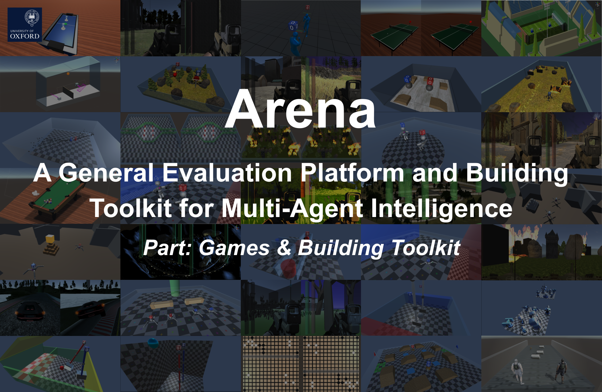

## Introduction

Multi-agent intelligence is still at the stage where many problems remain unexplored. Therefore, we provide a building toolkit for researchers to easily invent and build novel multi-agent problems from the provided games set based on a GUI-configurable social tree and five basic multi-agent reward schemes.
More resources ([arXiv paper](https://arxiv.org/abs/1905.08085), supplementary & documentation, [code of baselines](https://github.com/YuhangSong/Arena-Baselines)) can be found in [Arena Home](https://sites.google.com/view/arena-unity/).
If you use Arena to conduct research, we ask that you [cite the paper](#citation) as a reference.

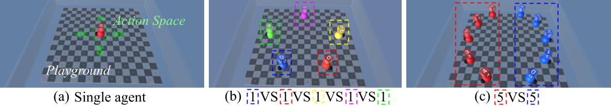

## Status: Beta

We are currently open to any suggestions or pull requests from the community to make Arena a better platform.
Some features mentioned in the paper may be not yet available, since we are trying to make the codebase more consistent and just re-structured the project.
To contribute to the project, see [TODO List](#todo-list-keep-updating).

* If you have a game in mind you want to study, you are wellcome to [contact us by clicking here](mailto:yuhang.song@cs.ox.ac.uk,lianlong.wu@cs.ox.ac.uk,iceclearwjy@buaa.edu.cn,maixu@buaa.edu.cn,zhenghua.xu@hebut.edu.cn,zd2418@ic.ac.uk) (or open an issue). We are happy to implement it for you, if it's helpful for the community.

## Project Structure

All games and abstraction layers share one Unity project.
Each game is held in an independent folder in ```ArenaSDK/GameSet/``, with the game's name as the folder name.
The folder ```ArenaSDK``` holds all the abstraction layers and share code, assets and utils.

* Games outside ```ArenaSDK/``` have not been merged into the new codebase yet, do not use them.

## Build Your Game

Take a look at the code of the game ```ArenaCrawlerPush``` as an example, which contains the example social tree mentioned in the paper.


The following tutorial will take you through making a multi-agent game with Arena building toolkit.
It will not require much coding work with many off-the-shelf assets and multi-agent features managed by Arena.

* Before you start, we are expecting you to have basic knowledge on Unity.
  Thus, you are recommended to finish the [Roll-a-ball tutorial](https://unity3d.com/learn/tutorials/s/roll-ball-tutorial) to learn all the basic concepts of Unity.
* Run Unity, choose open project, and select the cloned or downloaded `Arena-BuildingToolkit` file.  The opening process may take some time for the first time, take a coffee.
* Create a folder to host your game. In this tutorial, we create ```ArenaCrawlerPush```.
  
* Create a scene, name it ```2T2P```, which means we want there to be 2 team competing against each other, and within each team, there are 2 agents collaborating with each other. Thus, there will be 4 agents in total.
* Delete all items in the scene, create a new empty, name it ```GlobalManager```, reset the transform of the ```GlobalManager``` you just created. Then, attach the script GlobalManager to it through Add Component.
  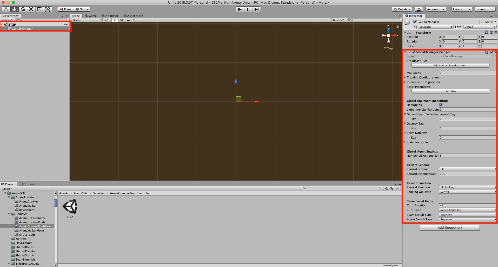
* Add a basic playground by dragging prefab ```Assets/ArenaSDK/Playground/Playground``` into the scene, as a child of the ```GlobalManager```.
  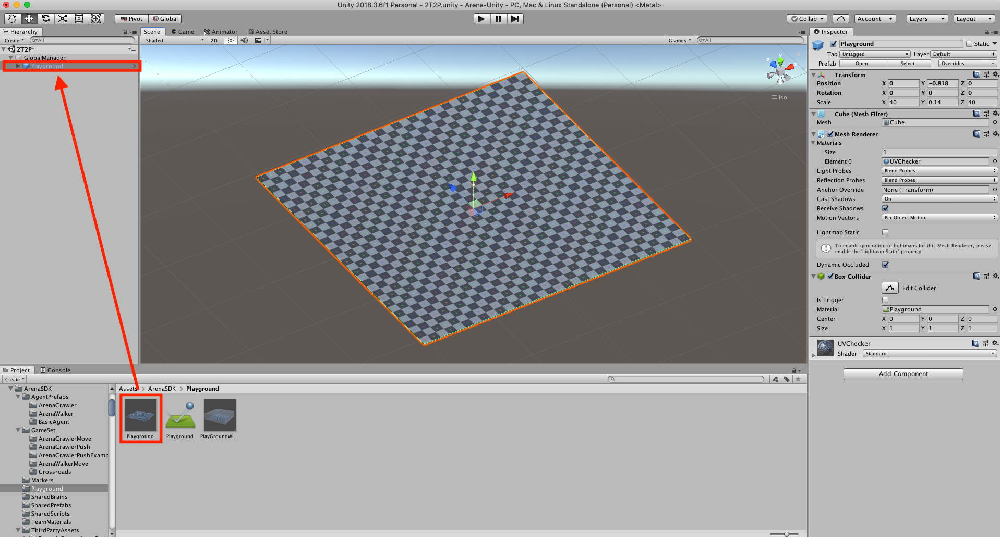
* Create a empty named ```Team``` as a child of ```GlobalManager```, attach the script ```ArenaTeam``` on it.
  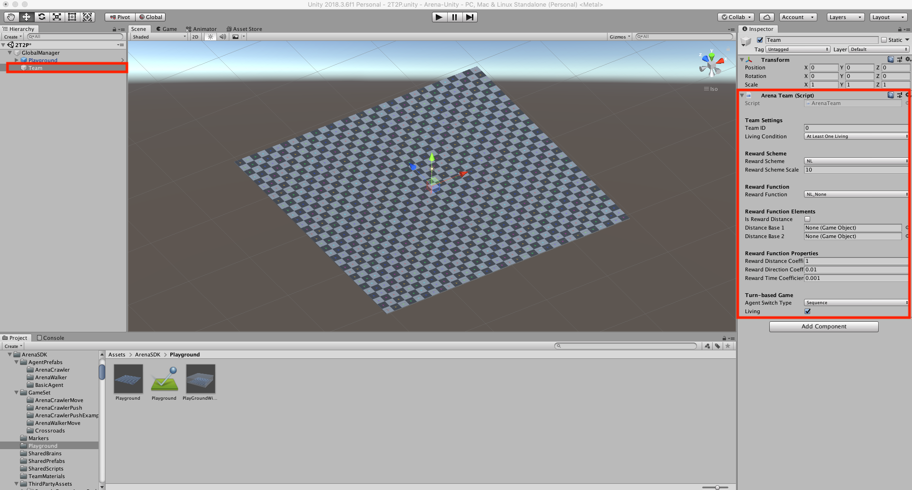
* Add an crawler robot agent by dragging prefab ```Assets/ArenaSDK/AgentPrefabs/ArenaCrawler/ArenaCrawlerAgent``` as a child of the Team object you just created.
  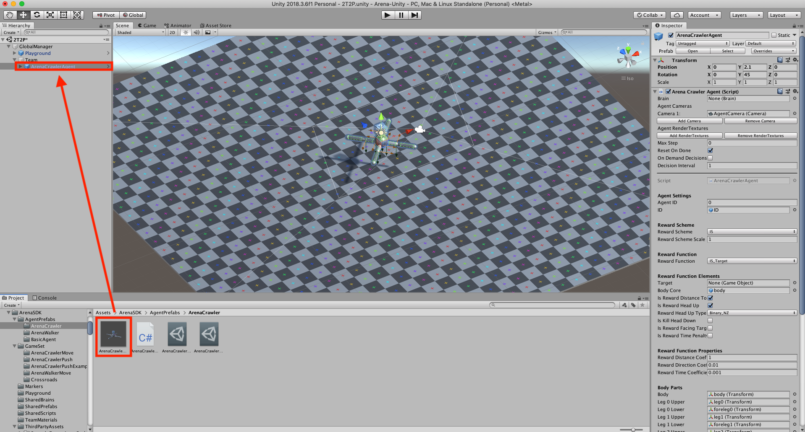
* Since we want two agents at a team, duplicate the ```ArenaCrawlerAgent``` you just created, move them apart so that they look like a cool team. And remember to change the ```Agent ID``` property of the duplicated ```ArenaCrawlerAgent (1)``` to ```1``` (default as 0), so that Arena knows it is a different agent.
  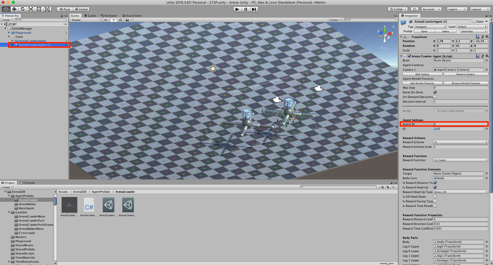
* We want the two agents to collaborate on pushing a Box, so let's create the Box by dragging prefab ```Assets/ArenaSDK/SharedPrefabs/Box``` into the scene, as a child of the ```Team```.
  
* We want two teams to compete with each other, so let's make another team. Sine we are expecting the two teams to be identical so that they have equal chance to win, let's first drag the ```Team``` object out to the Project window at the bottom as a prefab. Then duplicate the ```Team```, rotate the duplicated ```Team (1)``` so that the two teams seems to be fighting against each other. Remember to change the ```Team ID``` property of the duplicated ```Team (1)``` to ```1``` (default as 0), so that Arena knows it is a different team.
  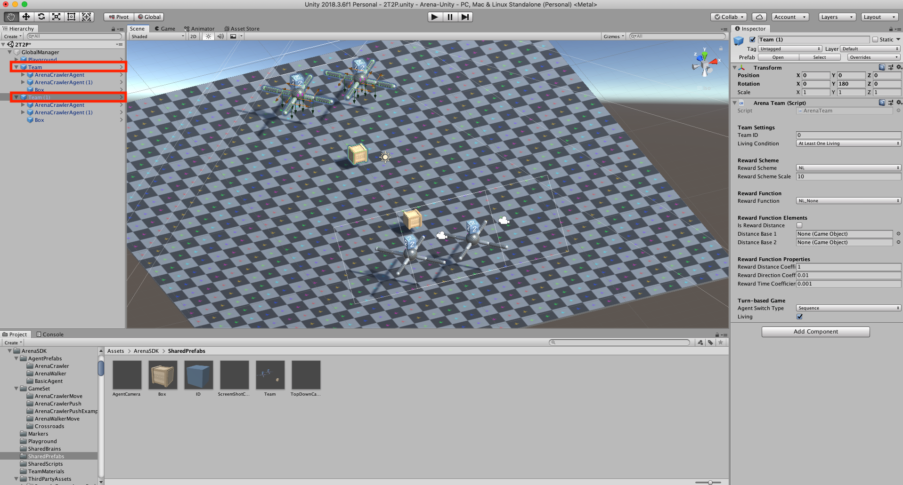
* We want the two teams to have a fight on which team pushes its Box to a target point first, so let's create this target point by dragging prefab ```Assets/ArenaSDK/SharedPrefabs/Goal``` into the scene as a child of ```GlobalManager```.
  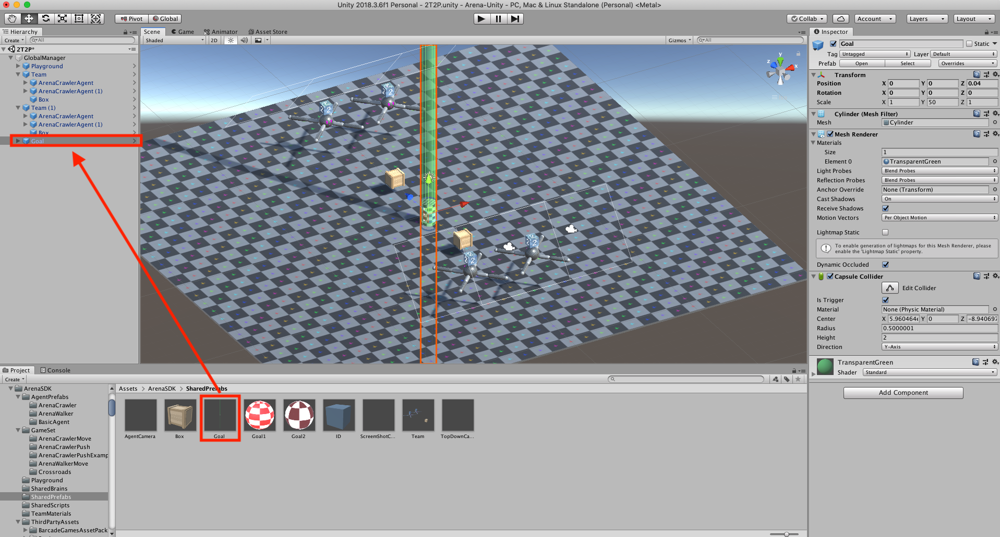
* Now we seems to have all we need, but a top-down view of the global game would be good for us to see what is going on in the game. So, drag prefab ```Assets/ArenaSDK/SharedPrefabs/TopDownCamera``` into the scene as a child of ```GlobalManager```. Adjust the size property of the ```TopDownCamera``` so that it fit well with the playground.
  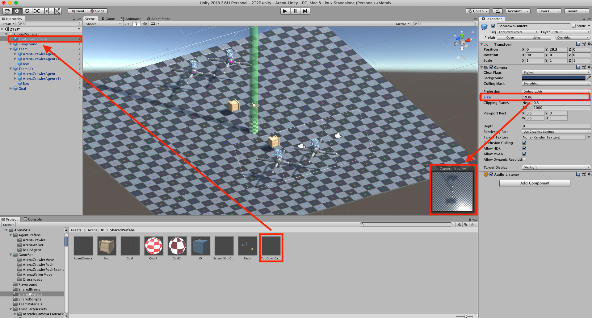
* Since you have two teams, add two ```Team Materials``` in the properties of ```GlobalManager``` so that they are used by the two teams to display different colors. ```Assets/ArenaSDK/TeamMaterials/``` provides many team colors you can use directly.
  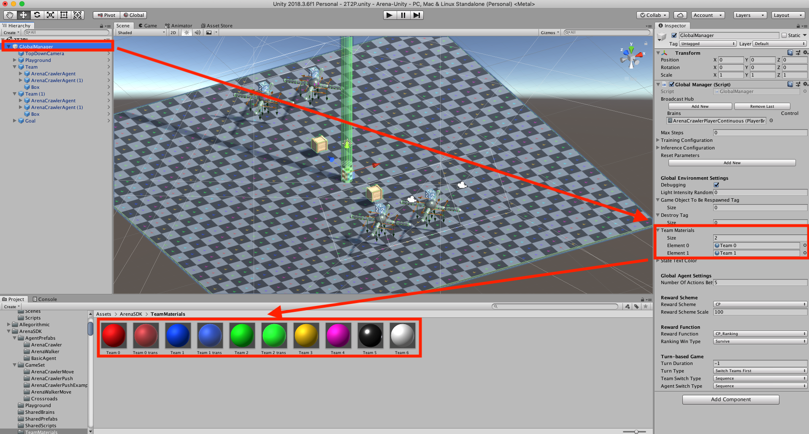
* Now, attach a player brain in the ```GlobalManager``` (all agents in the scene will by default use this brain). Since you are using ```ArenaCrawlerAgent``` as your agent, you can just use the brain ```Assets/ArenaSDK/AgentPrefabs/ArenaCrawler/ArenaCrawlerPlayerContinuous```
  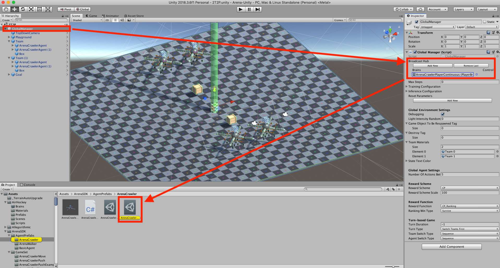
* Now you have all basic elements you need, try to run the game, you should see Arena automatically assigning the view port for each agent and top down camera, as well as dealing with other things like displaying team colors, agent id, so that agents knows the who is the teammate and who is the opponent.
  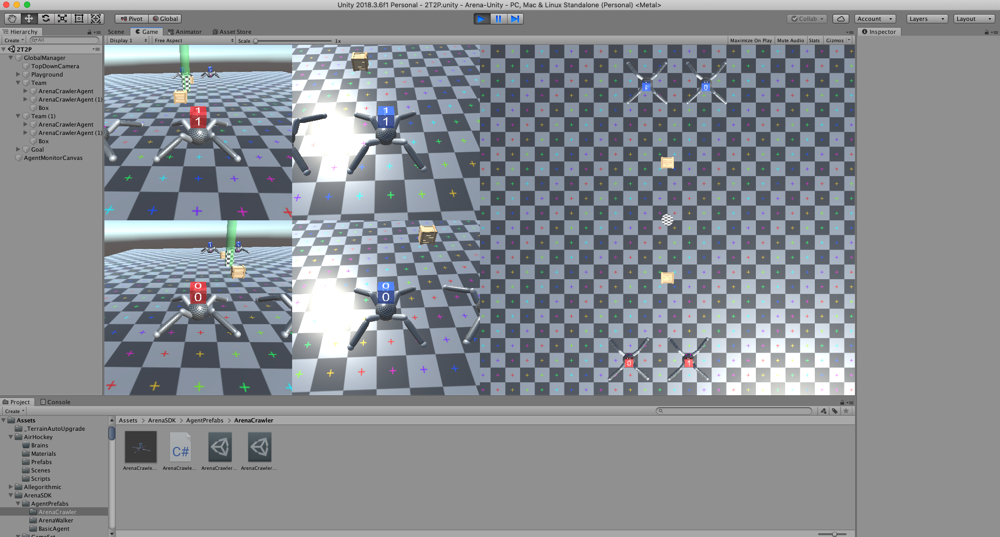
* Then, let's consider how to reward the agents. First, agent-level reward function is necessary for an agent to learn basic motion skills. Check the inspector of ```ArenaCrawlerAgent```, you can see many options of reward functions. Edit as following in the prefab Team, so that the other team uses the same settings. Here, we select options in the following picture, which means, the agent is rewarded based on the distance to the Box (Is Reward Distance To), and the agent is encouraged to keep head facing up (Is Reward Head Up).
  
* Now, you should test the reward function at this level before move on to other levels. You can set the property ```Debugging``` in ```GlobalManager``` to true and run the game. In scene editor, manually drag the position of the agent of AgentID=0 in team of TeamID=0. In the meantime, look at the printed CumulativeReward of the agent.
  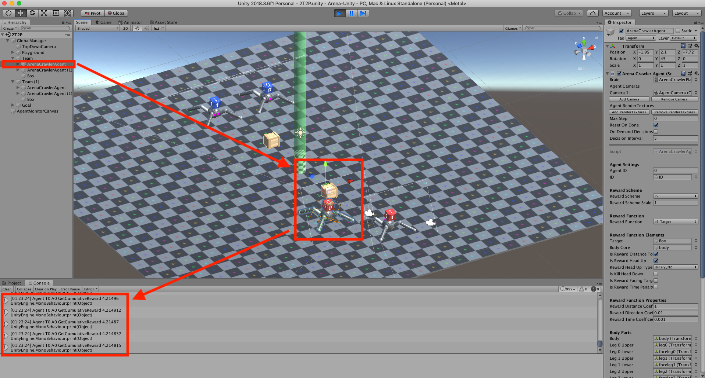
* Similarly, you can set the team-level reward function in ```Team``` as following picture (also in the ```Team``` prefab so that it applies to both teams), which means the team-level reward is the distance of the Box in the team to the Goal.
  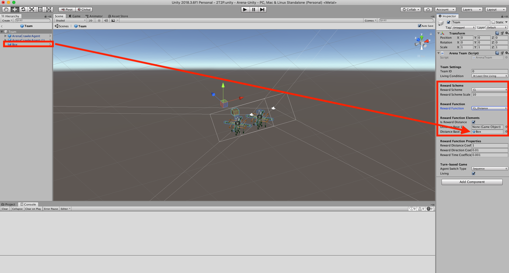
  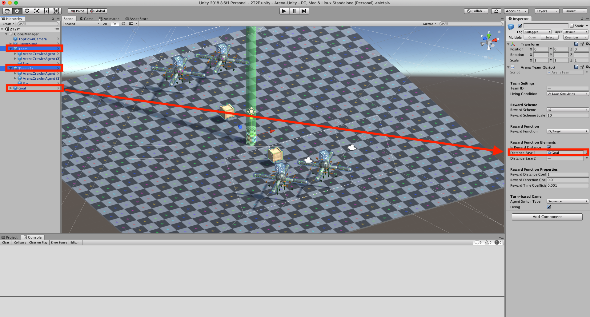
* And similarly, you should test the reward function at this level by entering play mode and dragging the Box.
* Finally, set the global level reward as following picture, which means the first team that departs the game wins.
  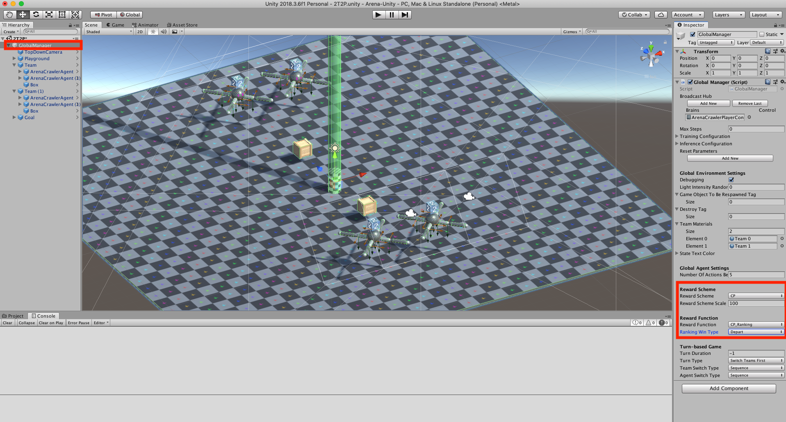
* As mentioned, now we make the team depart the game when it has pushed the Box to the Goal. This is achieved by attaching a script ```KillTeamGate``` to the object ```Goal```. Set ```Trig Tag``` to ```Box```, so that killing the team is triggered when the Box touches the Goal.
  
* And similarly, you should test the reward function at this level by entering play mode and dragging the Box to touch the Goal.
* Now, you may see that after you touch the Goal with the Box, the agent resets properly, but the Box did not reset. Go to GlobalManager and add tag ```Box``` to the ```Game Object To Be Respawned Tag```, so that Box will be reset at the end of every episode.
  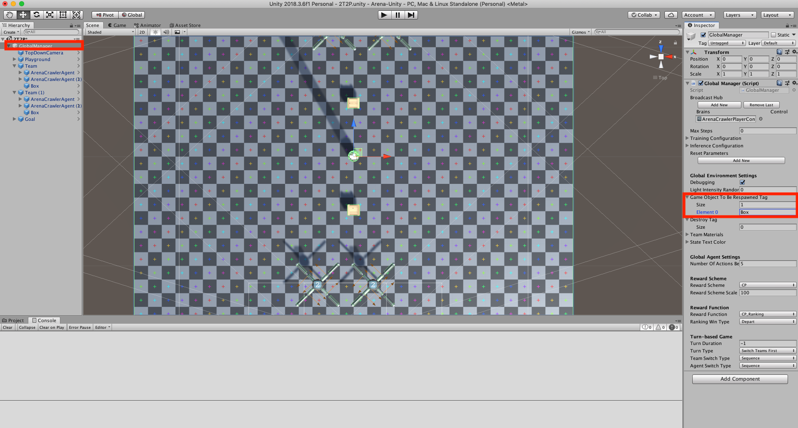
* Finally, you are ready to [compile your game to a binary file](#compile-game-to-binary-file) and train with it on [Arena-Baselines](https://github.com/YuhangSong/Arena-Baselines)!

Note that:
* You can see many options available in the inspector. To understand what they means, look into the code of the script, they are well-documented (at least I tried to, so let me know if anything confuses you).
* For creating games of basic agents that is not provided in Arena, or contributing to the code of Arena, you are expected to have deeper knowledge on [ML-Agents](https://github.com/Unity-Technologies/ml-agents). [Unity ML-Agents Toolkit Documentation](https://github.com/Unity-Technologies/ml-agents/blob/master/docs/Readme.md) would be a great start point.

## Compile Game to Binary File

* Change the player brain to corresponding learner brain in the ```GlobalManager```, and check Control box.
* Set property ```Debugging``` in the ```GlobalManager``` to false.
* Make sure you go to Build Settings > Player Settings and switch "Display Resolution Dialog" to Disabled or Hidden By Default.
* Build the game after selecting the right platform (Linux x86), put the binary file in ```Arena-Baselines/Bin/```. Name it ```<GameName-Platform>```, for example ```MyCoolGame-Linux```.
* Go to [Arena-Baselines](https://github.com/YuhangSong/Arena-Baselines) and train with it!

## TODO List (Keep Updating)

* I am super good at producing typos, thus, fix them!
* Games located in ```Assets/ArenaSDK/GameSet``` are those coded using new Arena abstraction layers, the game located in ```Assets/``` are those coded using old framework, which only support two players' competitive setting. Thus, I am working on re-code them using new Arena abstraction layers and put them in ```Assets/ArenaSDK/GameSet```
* Some games that seem to be valuable to the community but are currently not in Arena, listed as follows:
  * Real time strategy games

## Citation

If you use Arena to conduct research, we ask that you cite the following paper as a reference:
```
@article{song2019arena,
  title={Arena: A General Evaluation Platform and Building Toolkit for Multi-Agent Intelligence},
  author={Song, Yuhang and Wang, Jianyi and Lukasiewicz, Thomas and Xu, Zhenghua and Xu, Mai and Ding, Zihan and Wu, Lianlong},
  journal={arXiv preprint arXiv:1905.08085},
  year={2019}
}
```
as well as the engine behind Arena, without which the platform would be impossible to create
```
@article{juliani2018unity,
  title={Unity: A general platform for intelligent agents},
  author={Juliani, Arthur and Berges, Vincent-Pierre and Vckay, Esh and Gao, Yuan and Henry, Hunter and Mattar, Marwan and Lange, Danny},
  journal={arXiv preprint arXiv:1809.02627},
  year={2018}
}
```

## License

[Apache License 2.0](LICENSE)

## Acknowledgement

We give special thanks to the [Whiteson Research Lab](http://whirl.cs.ox.ac.uk/) and [ML-Agents team](https://unity3d.com/machine-learning/), with which the discussion shaped the vision of the project a lot.
Also, we use some free packages from [Unity Assets Store](https://assetstore.unity.com/) list in [the reference section](#references), the code of which is publically available in the Unity Assets Store.
We thank them for their generosity and contribution to the community.

We also use two packages that is not free (list in [the reference section](#references)), thus, the code of these two packages is not included in the code release.
But the compiled binary files are released in [Arena-Baselines](https://github.com/YuhangSong/Arena-Baselines).

## References
* [Tower Defense Template](https://assetstore.unity.com/packages/essentials/tutorial-projects/107692)
* [Low Poly Crates](https://assetstore.unity.com/packages/3d/props/80037)
* [Low Polygon Soccer Ball](https://assetstore.unity.com/packages/3d/84382)
* [Space Robot Kyle](https://assetstore.unity.com/packages/3d/characters/robots/4696)
* [Ragdoll and Transition to Mecanim](https://assetstore.unity.com/packages/templates/systems/ragdoll-and-transition-to-mecanim-38568)
* [Free Little Games Asset Pack](https://assetstore.unity.com/packages/3d/props/free-little-games-asset-pack-125089)
* [Video Capture](https://assetstore.unity.com/packages/tools/video/video-capture-75653)
* [SimplePoly Stadium Kit](https://assetstore.unity.com/packages/3d/environments/simplepoly-stadium-kit-59071)
* [Do not shoot Aliens - mobile game](https://assetstore.unity.com/packages/templates/packs/do-not-shoot-aliens-mobile-game-137557)
* [Space Shooter FREE](https://assetstore.unity.com/packages/templates/packs/space-shooter-free-107260)
* [Third Person Controller - Basic Locomotion FREE](https://assetstore.unity.com/packages/templates/systems/third-person-controller-basic-locomotion-free-82048)
* [Photon Unity Networking Classic - FREE](https://assetstore.unity.com/packages/tools/network/photon-unity-networking-classic-free-1786)
* [Sun Temple](https://assetstore.unity.com/packages/3d/environments/sun-temple-115417)
* [House On The Lake](https://assetstore.unity.com/packages/3d/environments/house-on-the-lake-95020)
* [Sci-Fi Styled Modular Pack](https://assetstore.unity.com/packages/3d/environments/sci-fi/sci-fi-styled-modular-pack-82913)
* [Nature Starter Kit 2](https://assetstore.unity.com/packages/3d/environments/nature-starter-kit-2-52977)
* [Mountain Race Track - Night](https://assetstore.unity.com/packages/3d/environments/roadways/mountain-race-track-night-68199)
* [Race Tracks](https://assetstore.unity.com/packages/3d/environments/roadways/race-tracks-140501)
* [Windridge City](https://assetstore.unity.com/packages/3d/environments/roadways/windridge-city-132222)
* [Flooded Grounds](https://assetstore.unity.com/packages/3d/environments/flooded-grounds-48529)
* [Rule Engine](https://assetstore.unity.com/packages/tools/rule-engine-60198)
* [Forge Networking Remastered](https://assetstore.unity.com/packages/tools/network/forge-networking-remastered-38344)
* [SmartFoxServer2X Multiplayer SDK](https://assetstore.unity.com/packages/tools/network/smartfoxserver2x-multiplayer-sdk-17261)
* [FPSME](https://assetstore.unity.com/packages/templates/systems/fpsme-114434)
* [Full Body FPS Controller](https://assetstore.unity.com/packages/templates/systems/full-body-fps-controller-134060)
* [Polygon City Pack - Environment and Interior [Free]](https://assetstore.unity.com/packages/3d/polygon-city-pack-environment-and-interior-free-101685)
* [Easy FPS](https://assetstore.unity.com/packages/3d/characters/humanoids/easy-fps-73776)
* [Sport Car - 3D model](https://assetstore.unity.com/packages/3d/characters/sport-car-3d-model-88076)
* [SBP Vehicle Physics](https://assetstore.unity.com/packages/3d/characters/sbp-vehicle-physics-60459)
* [The Virus war](https://assetstore.unity.com/packages/templates/the-virus-war-7891)
* [Simple Pinball](https://assetstore.unity.com/packages/templates/packs/simple-pinball-80053)
* [Lake Race Track](https://assetstore.unity.com/packages/3d/environments/roadways/lake-race-track-55908)
* [Free Barcade Asset Pack](https://assetstore.unity.com/packages/3d/props/free-barcade-asset-pack-123704)
* [Snake 3D cartoon with Pads Android Ready](https://assetstore.unity.com/packages/tools/integration/snake-3d-cartoon-with-pads-android-ready-74895)
* [Chainlink Fences](https://assetstore.unity.com/packages/3d/chainlink-fences-73107)
* [Post Processing Stack](https://assetstore.unity.com/packages/essentials/post-processing-stack-83912)
* [Low Poly Boxing LITE](https://assetstore.unity.com/packages/3d/characters/humanoids/low-poly-boxing-lite-133958)
* [Fighting Motions Vol.1](https://assetstore.unity.com/packages/3d/animations/fighting-motions-vol-1-76699)
* [Fighter Interceptor](https://assetstore.unity.com/packages/3d/vehicles/air/fighter-interceptor-102321)
* [Mixed Motion](https://assetstore.unity.com/packages/3d/animations/mixed-motion-25837)
* [T95 Super Heavy Tank](https://assetstore.unity.com/packages/3d/vehicles/land/t95-super-heavy-tank-101164)
* [Fantasy Defensive Structures](https://assetstore.unity.com/packages/3d/environments/fantasy/fantasy-defensive-structures-3307)
* [Tileable Bricks Wall](https://assetstore.unity.com/packages/2d/textures-materials/brick/tileable-bricks-wall-24530)
* [Terrain Textures - Snow - Free Samples](https://assetstore.unity.com/packages/2d/textures-materials/floors/terrain-textures-snow-free-samples-54630)
* [15 Original Bricks Textures](https://assetstore.unity.com/packages/2d/textures-materials/brick/15-original-bricks-textures-72427)
* [Tank - Mark V drivable](https://assetstore.unity.com/packages/3d/vehicles/land/tank-mark-v-drivable-76008)
* [Simple Health Bar FREE](https://assetstore.unity.com/packages/tools/gui/simple-health-bar-free-95420)
* [SciFi Enemies and Vehicles](https://assetstore.unity.com/packages/3d/characters/robots/scifi-enemies-and-vehicles-15159)
* [Free Trees](https://assetstore.unity.com/packages/3d/vegetation/trees/free-trees-103208)
* [Tree Randomizer](https://assetstore.unity.com/packages/tools/utilities/tree-randomizer-59228)
* [Rock Pack](https://assetstore.unity.com/packages/3d/environments/landscapes/rock-pack-19856)
* [Substance in Unity](https://assetstore.unity.com/packages/tools/utilities/substance-in-unity-110555)
* [Hand Painted Grass Texture](https://assetstore.unity.com/packages/2d/textures-materials/floors/hand-painted-grass-texture-78552)
* [Stone Floor Texture](https://assetstore.unity.com/packages/2d/textures-materials/stone/stone-floor-texture-20336)
* [Unity Particle Pack 5.x](https://assetstore.unity.com/packages/essentials/asset-packs/unity-particle-pack-5-x-73777)
